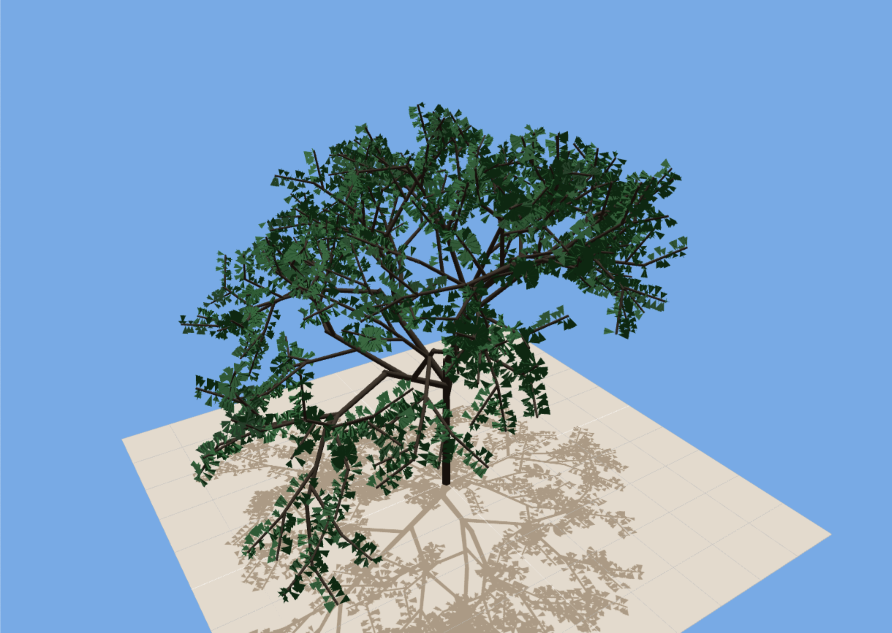

# An L-system tree

This is a simple implementation of a tree built with an [L-System](https://en.wikipedia.org/wiki/L-system).
The implementation is a React+Vite app and uses [react-three-fiber](https://github.com/pmndrs/react-three-fiber) for the 3d rendering.

## Screenshot

